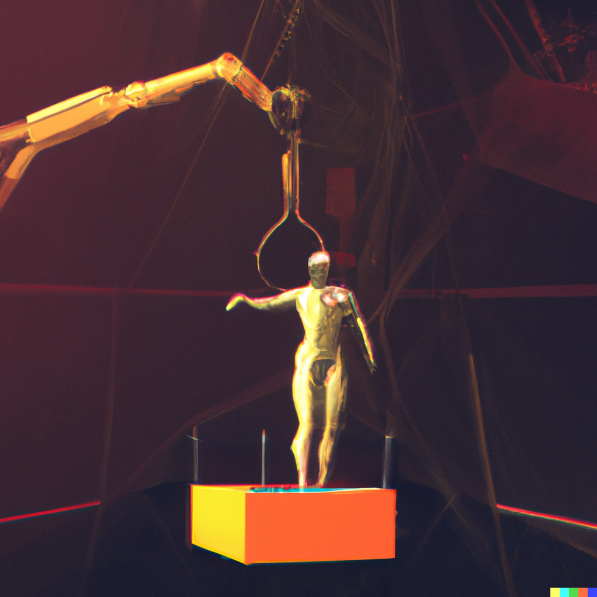

# machina

[![ci-badge]][ci-workflow]
[![stability-experimental-badge]][stability-index]
[![maintenance-best-effort-badge]][current-issues]

[ci-badge]: https://github.com/despan/machina/actions/workflows/ci.yml/badge.svg
[ci-workflow]: https://github.com/despan/machina/actions/workflows/ci.yml
[stability-experimental-badge]: https://img.shields.io/badge/Stability-experimental-orange.svg
[stability-index]: https://nodejs.org/api/documentation.html#documentation_stability_index
[maintenance-best-effort-badge]: https://img.shields.io/badge/Maintenance-best%20effort-orange
[current-issues]: https://github.com/despan/machina/issues

Proof-of-concept browser automation toolkit

### Installation

Clone this repostory

```sh
git clone https://github.com/despan/machina.git
```

Install dependencies

```sh
npm install
```

### Testing

Run tests with Jest

```sh
npm run test
```


